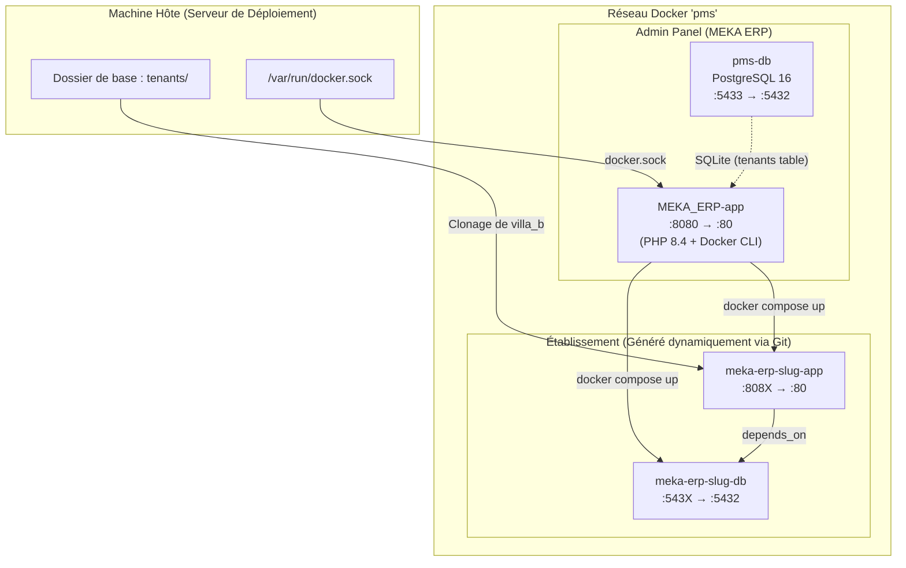
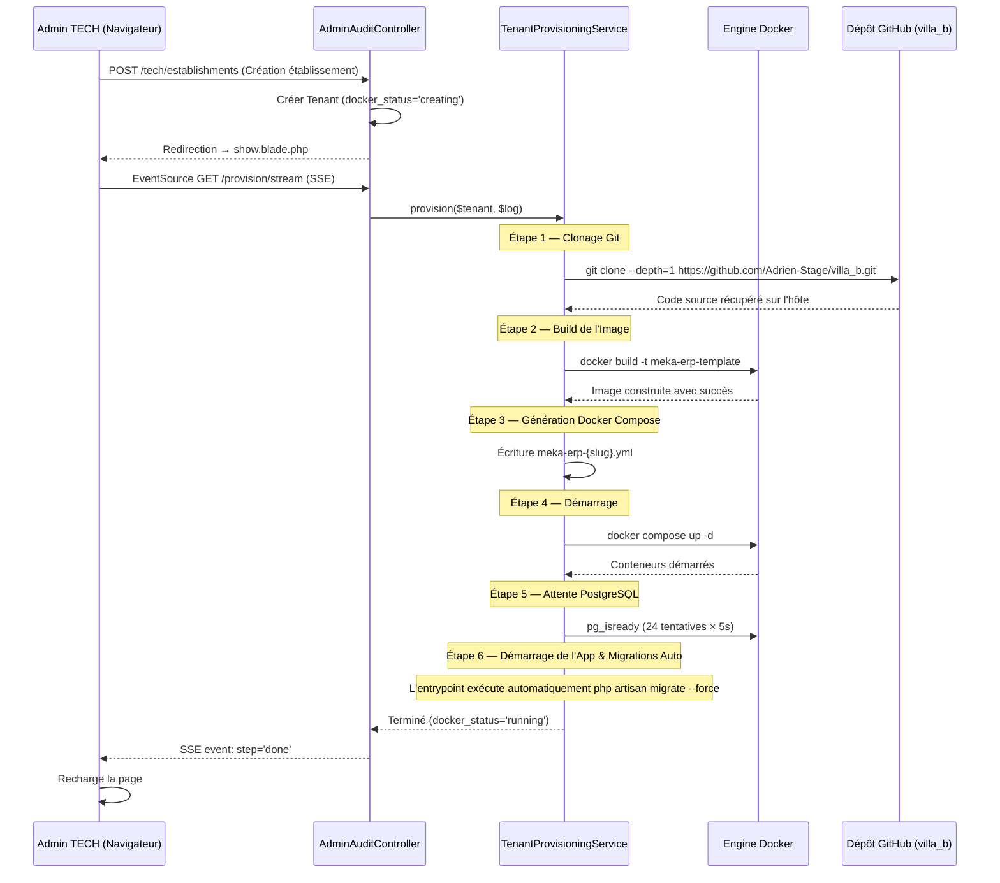

# 🏨 MEKA ERP — Guide de Résolution du Provisioning

> **Objectif** : Résoudre définitivement le blocage lors de la création d'établissements depuis le panel admin `erp_pms`, en s'appuyant uniquement sur le dépôt GitHub `https://github.com/Adrien-Stage/villa_b.git` comme source unique du code applicatif.

---

## 1. Architecture MEKA ERP



### Naming & Préfixes
Conformément à la charte de MEKA ERP, les préfixes ont été uniformisés :
- Image Docker : `meka-erp-template`
- Containers : `meka-erp-{slug}-app` et `meka-erp-{slug}-db`
- Volumes DB : `meka_erp_{slug}_pgdata`

---

## 2. Flux de Provisioning (Source Unique GitHub)



---

## 3. Causes Racines des Blocages Identifiées & Résolues

### 🔴 Cause #1 : Conflit de Volume (Écrasement du Build)
- **Problème** : Le docker-compose généré montait le code source via un volume par-dessus l'image Docker contenant le build (`vendor/`, compilations Vite, etc.).
- **Résolution** : **Suppression du volume mount** pour le code source dans le docker-compose généré. Le conteneur s'exécute désormais de manière 100% autonome à partir de l'image buildée.

### 🔴 Cause #2 : Migrations manquées au démarrage
- **Problème** : Les migrations étaient lancées via `docker exec php artisan migrate` depuis le conteneur admin, ce qui échouait si le conteneur de l'établissement n'était pas encore pleinement stable.
- **Résolution** : Ajout de l'exécution automatique des migrations (`php artisan migrate --force`) et seeders conditionnels directement dans le script d'entrée [entrypoint.sh](file:///c:/Users/user/Herd/villab/docker/entrypoint.sh) du conteneur de l'établissement.

### 🔴 Cause #3 : Timeouts de Connexion SSE
- **Problème** : Le build et le démarrage prenaient plus de temps que le timeout Nginx par défaut (60 secondes), fermant le flux SSE prématurément et bloquant l'affichage.
- **Résolution** : Augmentation du timeout FastCGI de Nginx à 10 minutes (`fastcgi_read_timeout 600`), désactivation du buffering Nginx pour le SSE, et ajout de `set_time_limit(600)` dans le contrôleur.

### 🔴 Cause #4 : Absence de `.dockerignore`
- **Problème** : Le build transférait tous les dossiers locaux (dont `node_modules` et `vendor` volumineux), augmentant inutilement le temps de build.
- **Résolution** : Création d'un fichier [.dockerignore](file:///c:/Users/user/Herd/villab/.dockerignore) pour ignorer ces dossiers.

---

## 4. Détails des Fichiers Modifiés

### 4.1 Projet `villa_b` (Template applicatif)

#### 📄 [Dockerfile](file:///c:/Users/user/Herd/villab/Dockerfile) (Extrait - Healthcheck)
```dockerfile
EXPOSE 80

HEALTHCHECK --interval=30s --timeout=5s --retries=3 \
    CMD curl -f http://localhost/ || exit 1

ENTRYPOINT ["/usr/local/bin/entrypoint.sh"]
```

#### 📄 [entrypoint.sh](file:///c:/Users/user/Herd/villab/docker/entrypoint.sh) (Complet)
```bash
#!/bin/bash
set -e

echo "🏨 MEKA ERP — Démarrage du container établissement"
echo "    Tenant : ${TENANT_SLUG:-inconnu}"
echo "    DB     : ${DB_DATABASE} @ ${DB_HOST}:${DB_PORT}"

# ── Attendre PostgreSQL ───────────────────────────────────────────────────────
echo "⏳ Attente de PostgreSQL..."
MAX=30
COUNT=0
until pg_isready -h "${DB_HOST}" -p "${DB_PORT}" -U "${DB_USERNAME}" -d "${DB_DATABASE}" -q; do
    COUNT=$((COUNT + 1))
    if [ "$COUNT" -ge "$MAX" ]; then
        echo "❌ PostgreSQL non disponible après ${MAX} tentatives. Abandon."
        exit 1
    fi
    echo "   tentative ${COUNT}/${MAX}..."
    sleep 3
done
echo "✅ PostgreSQL disponible."

# ── Générer APP_KEY si absente ────────────────────────────────────────────────
if [ -z "${APP_KEY}" ]; then
    echo "🔑 Génération d'une APP_KEY..."
    APP_KEY=$(php artisan key:generate --show --no-interaction)
    export APP_KEY
fi

# ── Optimisations Laravel ─────────────────────────────────────────────────────
echo "⚙️  Optimisation de la configuration Laravel..."
php artisan config:cache  --no-interaction 2>/dev/null || true
php artisan route:cache   --no-interaction 2>/dev/null || true
php artisan view:cache    --no-interaction 2>/dev/null || true

# ── Migrations + Seeders (exécutées automatiquement) ──────────────────────────
echo "🗄️  Exécution des migrations..."
php artisan migrate --force --no-interaction 2>&1 || {
    echo "⚠️  Échec des migrations. Voir les logs pour plus de détails."
}

# Seeder uniquement si la table users est vide (premier lancement)
USER_COUNT=$(php artisan tinker --execute="echo \App\Models\User::count();" 2>/dev/null || echo "0")
if [ "$USER_COUNT" = "0" ] || [ -z "$USER_COUNT" ]; then
    echo "🌱 Base vide — exécution des seeders..."
    php artisan db:seed --force --no-interaction 2>&1 || {
        echo "⚠️  Échec des seeders."
    }
else
    echo "📦 Base déjà peuplée ($USER_COUNT users) — seeders ignorés."
fi

# ── Permissions storage ───────────────────────────────────────────────────────
chown -R www-data:www-data /var/www/html/storage /var/www/html/bootstrap/cache 2>/dev/null || true

echo "🚀 Lancement des services (nginx + php-fpm)..."
exec /usr/bin/supervisord -n
```

#### 📄 [.dockerignore](file:///c:/Users/user/Herd/villab/.dockerignore) (Complet)
```
.git
.gitignore
.gitattributes
.env
.env.backup
.env.production
node_modules
vendor
tests
storage/logs/*
storage/framework/cache/*
storage/framework/sessions/*
storage/framework/views/*
*.md
*.log
.phpunit.cache
.idea
.vscode
.fleet
docker-compose*.yml
fix_*.php
```

---

### 4.2 Projet `erp_pms` (Admin global)

#### 📄 [TenantProvisioningService.php](file:///c:/Users/user/Herd/pms/app/Services/TenantProvisioningService.php) (Extrait - docker-compose généré sans volume)
```php
        $yaml = <<<YAML
services:

  {$appContainer}:
    image: {$imageName}
    container_name: {$appContainer}
    restart: unless-stopped
    ports:
      - "{$appPort}:80"
    environment:
      APP_NAME: "{$tenant->name}"
      APP_ENV: production
      APP_DEBUG: "false"
      APP_KEY: "{$appKey}"
      APP_URL: "{$appUrl}"
      DB_CONNECTION: pgsql
      DB_HOST: {$dbContainer}
      DB_PORT: 5432
      DB_DATABASE: {$dbName}
      DB_USERNAME: {$dbUser}
      DB_PASSWORD: {$dbPass}
      TENANT_SLUG: "{$tenant->slug}"
      TENANT_CURRENCY: "{$currency}"
      TENANT_SETTINGS: '{$settingsJson}'
      TENANT_MODULES: '{$modulesJson}'
      SESSION_DRIVER: database
      CACHE_STORE: database
      QUEUE_CONNECTION: database
    depends_on:
      {$dbContainer}:
        condition: service_healthy
    networks:
      - {$network}

  {$dbContainer}:
    image: postgres:16
    container_name: {$dbContainer}
    restart: unless-stopped
    ports:
      - "{$dbPort}:5432"
    environment:
      POSTGRES_DB: {$dbName}
      POSTGRES_USER: {$dbUser}
      POSTGRES_PASSWORD: {$dbPass}
    volumes:
      - meka_erp_{$tenant->slug}_pgdata:/var/lib/postgresql/data
    healthcheck:
      test: ["CMD-SHELL", "pg_isready -U {$dbUser} -d {$dbName}"]
      interval: 5s
      timeout: 5s
      retries: 10
    networks:
      - {$network}

networks:
  {$network}:
    external: true

volumes:
  meka_erp_{$tenant->slug}_pgdata:

YAML;
```

#### 📄 [AdminAuditController.php](file:///c:/Users/user/Herd/pms/app/Http/Controllers/AdminAuditController.php) (Extrait - SSE stream)
```php
    public function provisionTenantStream(Tenant $tenant, \App\Services\TenantProvisioningService $provisioner)
    {
        $user = Auth::user();
        if (!$user || !$user->isTechAdmin()) { abort(403); }

        // Augmenter le temps d'exécution max pour le provisioning (10 min)
        set_time_limit(600);
        ini_set('max_execution_time', '600');

        return response()->stream(function () use ($tenant, $provisioner) {
            // Désactiver le buffering de sortie pour SSE
            if (ob_get_level()) {
                ob_end_clean();
            }
            ob_implicit_flush(true);

            $send = function (string $step, string $message, string $level = 'info') {
                $payload = json_encode([
                    'step'    => $step,
                    'message' => $message,
                    'level'   => $level,
                    'time'    => now()->format('H:i:s'),
                ]);
                echo "data: {$payload}\n\n";
                if (ob_get_level()) {
                    ob_flush();
                }
                flush();
            };
            // ... reste du code
```

#### 📄 [nginx.conf](file:///c:/Users/user/Herd/pms/docker/app/nginx.conf) (Extrait - Timeouts SSE)
```nginx
    location ~ \.php$ {
        fastcgi_pass 127.0.0.1:9000;
        fastcgi_index index.php;
        fastcgi_param SCRIPT_FILENAME $realpath_root$fastcgi_script_name;
        include fastcgi_params;
        fastcgi_param HTTP_HOST $http_host;
        fastcgi_param SERVER_NAME $http_host;

        # Timeouts étendus pour le SSE provisioning (10 min)
        fastcgi_read_timeout 600;
        fastcgi_send_timeout 600;
        fastcgi_connect_timeout 60;
        fastcgi_buffering off;
    }
```
